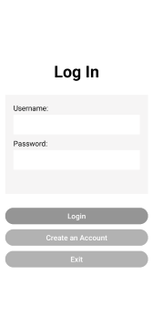
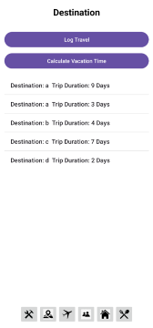
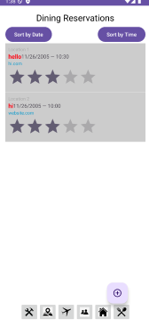

# WanderSync: A Collaborative Travel Management System

## Introduction
**WanderSync** is an application that simplifies the process of creating and managing travel itineraries for solo and group travelers. With features such as real-time collaboration, secure account creation, and seamless integration of travel details, WanderSync redefines the travel planning experience.

The app allows users to:
- Organize locations, transportation, accommodations, dining reservations, and personal notes.
- Collaborate in real-time with group members to create shared travel agendas.
- Synchronize updates seamlessly among all group members.

---

## Design & Architecture
WanderSync leverages the **MVVM (Model-View-ViewModel)** architectural pattern for clean separation of concerns, scalability, and efficient data binding. Firebase is utilized for secure user authentication and database storage, ensuring real-time collaboration capabilities. The Observer Pattern was used for real-time data updates across multiple user session, and the Strategy Pattern was pplied for flexible handling of user-specific data, such as accommodations and dining preferences.

### UML Diagram
Below are our UML diagrams to demonstrate an overview of the system's design structure:

- **Design Class Diagram**: The central hub for managing your trip.

- **Domain Model**: The central hub for managing your trip.

- **Sequence Diagram**: The central hub for managing your trip.

---

## User Interface (UI)
The user interface is designed to be intuitive and user-friendly, focusing on ease of navigation and interaction. Below are some screenshots of the app's key screens:

<table border="0">
 <tr>
    <td align="center"><b style="font-size:30px">Home/Logistics Screen</b>  The central hub for managing your trip. </td>
    <td align="center"><b style="font-size:30px">Login Screen</b>   Where users log into the app.</td>
 </tr>
 <tr>
    <td align="center">
     

</td>  
    <td align="center">
     

</td>
 </tr>
  <tr>
    <td align="center"><b style="font-size:30px">Destinations Screen</b> Log and view all your travel destinations. </td>
    <td align="center"><b style="font-size:30px">Dining Establishments Screen</b> Manage dining reservations with real-time updates.</td>
 </tr>
 <tr>
    <td align="center">
     

    </td>
    <td align="center">
     

    </td>
 </tr>
  <tr>
    <td align="center"><b style="font-size:30px">Accommodations Screen</b>   Manage travel accommodations.</td>
    <td align="center"><b style="font-size:30px">Splash Screen</b>  The screen that welcomes users to WanderSync!</td>
 </tr>
 <tr>
    <td align="center">
     

    </td>
    <td align="center">
     

    </td>
 </tr>
   <tr>
    <td align="center"><b style="font-size:30px">Travel Community Screen</b>  Manage travel plans with other users.</td>
 </tr>
 <tr>
    <td align="center">
     

    </td>
 </tr>
</table>

---

## Functionality
WanderSync offers the following core functionalities:
- **Secure User Authentication**: Powered by Firebase to store user credentials securely.
- **Travel Itinerary Management**: Organize destinations, transportation, accommodations, and dining reservations in one place.
- **Real-Time Collaboration**: Share itineraries with group members and synchronize updates in real-time.

### Video Demonstration
Watch WanderSync in action: 

---

## Conclusions and Reflections

### Project Outcomes
The development of **WanderSync** was a highly rewarding experience that showcased our ability to collaborate effectively as a team and create a meaningful product. The final application achieved the following:
- Simplified travel planning for solo and group travelers.
- Integrated seamless real-time collaboration tools with Firebase.
- Delivered a user-friendly interface for logging destinations, accommodations, and dining preferences.
- Provided an intuitive visualization of planned versus available travel days.

Our app's core functionalities, such as secure authentication and trip organization, successfully aligned with the project's goals. Additionally, the iterative development process allowed us to incorporate feedback and refine the application across multiple sprints.

---

### Contributions
Each team member played a vital role in bringing WanderSync to life:

- **Deborah Zhang**:
  - Designed and implemented key UI elements for the Logistics, Destination, and Dining screens.
  - Coordinated Firebase integration for secure user authentication and database management.

- **Jasmine Yuen**:
  - Focused on backend development, including database architecture for dining and accommodation records.
  - Built and optimized the functionality for calculating trip durations and linking user inputs to Firebase.

- **Jennifer Jiang**:
  - Designed user-friendly interfaces and ensured adherence to UI/UX principles.
  - Tested and debugged UI components to ensure a seamless user experience.

- **Ian Hennessy**:
  - Spearheaded real-time collaboration features, enabling group members to share itineraries, notes, and updates.

- **Varenya Amagowni**:
  - Worked on the Destination and Travel Community screens, enabling users to log destinations and share travel plans.
  - Integrated sorting and filtering mechanisms for travel community posts.

- **Amy Yang**:
  - Developed the Dining and Accommodation screens, allowing users to log and view reservations.
  - Designed sorting and grouping methods to organize entries by date and time.

---

### Challenges Encountered
The project was not without its challenges. Some of the key obstacles we faced included:
1. **Firebase Integration**:
   - Establishing secure user authentication and syncing real-time data required learning and applying Firebase tools efficiently.
2. **Complex Data Relationships**:
   - Linking destinations, accommodations, dining reservations, and user data while maintaining consistency across the database.
3. **Real-Time Collaboration**:
   - Developing a seamless synchronization system to allow multiple users to edit and view travel plans simultaneously.

---

### Knowledge Gained
This project allowed us to grow both technically and professionally. Some of the key learnings include:
- **Agile Development**:
  - We successfully utilized Agile practices, breaking the project into manageable sprints and iterating based on feedback.
- **UI/UX Principles**:
  - We learned to design intuitive interfaces that prioritize the user’s needs and improve the overall experience.
- **Team Collaboration**:
  - Collaborating in a remote environment taught us the importance of clear communication, task delegation, and conflict resolution.
- **Technical Skills**:
  - We gained hands-on experience with Firebase, Android Studio, data visualization libraries, and implementing design patterns such as MVVM and Observer.

We are proud of the final product and the teamwork that made it possible. WanderSync has not only enhanced our technical skills but also prepared us to tackle real-world challenges in software development.

## Project Contributors

- **Deborah Zhang** (Created this GitHub Pages website)
- **Jasmine Yuen** (Created this GitHub Pages website)
- **Varenya Amagowni**
- **Jennifer Jiang** (Created this GitHub Pages website)
- **Amy Yang**
- **Ian Hennessy**

---

Feel free to reach out for more information or feedback!
